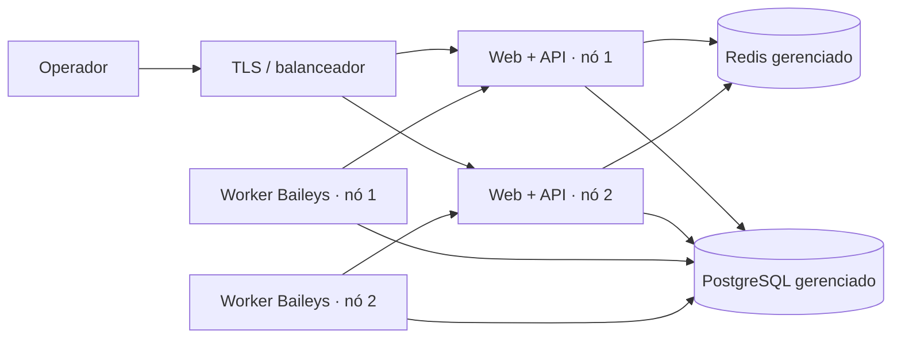

# Operação da plataforma distribuída

Este documento descreve a plataforma atual e seu processo de implantação.

## Componentes



O PostgreSQL é a autoridade sobre contas, sessões, campanhas, jobs e leases. Redis transporta somente eventos do painel. Credenciais Baileys são serializadas pelo worker, criptografadas pela API e persistidas no banco. A chave de criptografia nunca deve ficar na imagem.

## Desenvolvimento local

Pré-requisitos: Docker Desktop ou Docker Engine com Compose v2.

1. Copie `.env.scaled.example` para `.env.scaled`.
2. Gere valores exclusivos para `AUTOWPP_JWT_SECRET`, `AUTOWPP_WORKER_TOKEN` e `AUTOWPP_ENCRYPTION_KEY`.
3. Inicie a pilha:

```powershell
docker compose --env-file .env.scaled up -d --build
```

4. Abra `http://localhost:8080`, entre com o administrador configurado, defina o teto diário por chip e configure o card global da mensagem.
5. Clique em **Criar ou completar 30 chips**.
6. Ative somente um chip por vez e escaneie o QR. O chip só fica `ready` após a sessão e o número serem confirmados pelo WhatsApp.

Não existe conector simulado no runtime. Toda confirmação final de campanha representa envio real. Para desligar sem apagar os volumes:

```powershell
docker compose down
```

Não use `docker compose down -v` se quiser preservar banco, sessões e auditoria.

## Produção em dois nós

Use PostgreSQL e Redis gerenciados, privados e compartilhados. Antes de iniciar ou atualizar as réplicas, execute a migração uma única vez no nó 1:

```bash
docker compose --env-file /etc/autowpp/node.env -f compose.node.yaml run --rm --no-deps api alembic upgrade head
```

Depois, em cada nó, configure um arquivo de ambiente fora do repositório e execute:

```bash
docker compose --env-file /etc/autowpp/node.env -f compose.node.yaml up -d
```

Valores que precisam ser diferentes:

| Nó | `AUTOWPP_NODE_ID` | `AUTOWPP_WORKER_ID` | capacidade normal |
|---|---|---|---:|
| 1 | `node-1` | `worker-node-1` | 15 |
| 2 | `node-2` | `worker-node-2` | 15 |

Os demais segredos e URLs precisam ser iguais. Aponte o balanceador TLS para a porta 8080 dos dois nós. Para absorção temporária da frota durante manutenção, altere `AUTOWPP_WORKER_CAPACITY` para 30 no nó sobrevivente; o lease vencido só será assumido após 90 segundos.

A dependência Baileys está fixada no `worker/package-lock.json`; atualizações devem passar novamente pelos testes automatizados, canário e soak.

## Primeiro uso

1. Troque a senha bootstrap e nunca publique os valores padrão do Compose.
2. Configure no painel o teto por chip (por exemplo, 35/chip/dia), janela e fuso.
3. Configure o card global com imagem JPG/PNG, texto e URL HTTPS.
4. Crie os 30 registros de conta.
5. Ative um chip, abra o QR e escaneie pelo WhatsApp.
6. Faça um canário com esse único chip e um número controlado antes de ativar os demais.

Uma campanha pode estar ativa por vez. Jobs adicionais ficam agendados. O agendador usa somente contas `ready`, balanceia pela disponibilidade e volume enviado, aplica jitter de 70%–130% e leva excesso para a próxima janela útil.

## Importação e query

CSV e XLSX precisam conter `Telefone`, `pessoaId`, `Credor` e `Campanha`; `Nome`, `email` e `observacao` são opcionais. O painel mostra bruto, válido, duplicado e inválido antes da campanha.

O botão de query executa exclusivamente `backend/app/sql/contact_export.sql`, com timeout e limite de linhas. Um administrador cadastra `SERVER_OLD`, `DATABASE_OLD`, `USERNAME_OLD` e `PASSWORD_OLD` na tela Configurações; a senha é armazenada criptografada e não volta para o navegador. As variáveis `AUTOWPP_SOURCE_SQL_*` continuam disponíveis como fallback de implantação. O botão gera XLSX para download e nunca cria campanha automaticamente.

## Falhas e recuperação

- Heartbeat ocorre a cada 10 segundos; após 30 segundos a conta fica degradada e após 90 segundos seu lease pode ser assumido.
- Job apenas `leased` volta à fila após expiração. Job que já chegou a `sending` vai para `review_required` e nunca é repetido automaticamente.
- Logout ou sessão inválida muda a conta para `qr_required`; as demais continuam processando.
- PostgreSQL usa transações, bloqueios de linha e `SKIP LOCKED` para impedir claim duplo.
- Redis indisponível degrada atualizações em tempo real, mas não perde estado nem autoriza claims.

## Observabilidade e backup

- `GET /health/live`: processo ativo.
- `GET /health/ready`: banco acessível.
- `GET /metrics`: métricas Prometheus por estado de chip e job.
- Logs de contêiner: `docker compose --env-file .env.scaled logs -f api worker-node-1 worker-node-2`.

Configure alertas externos para QR/offline por mais de 2 minutos, fila sem progresso por 5 minutos, taxa de erro acima de 5% em 15 minutos e ausência de heartbeat. Faça backups automáticos do PostgreSQL com retenção e teste a restauração em outro banco antes da liberação. Redis não substitui backup.

## Validação para liberação

Os testes automatizados verificam distribuição entre contas, teto diário individual, autenticação elegível, importação, leases vencidos e resultados incertos. Execute:

```bash
python -m pytest backend/tests
npm --prefix web ci && npm --prefix web run build
npm --prefix worker ci && npm --prefix worker test
docker compose config --quiet
```

O soak de 8 horas exige 30 sessões reais e deve ser feito no ambiente de homologação. Só avance quando CPU e memória permanecerem abaixo de 70%, sem duplicação, perda, fila estagnada ou QR oculto.
